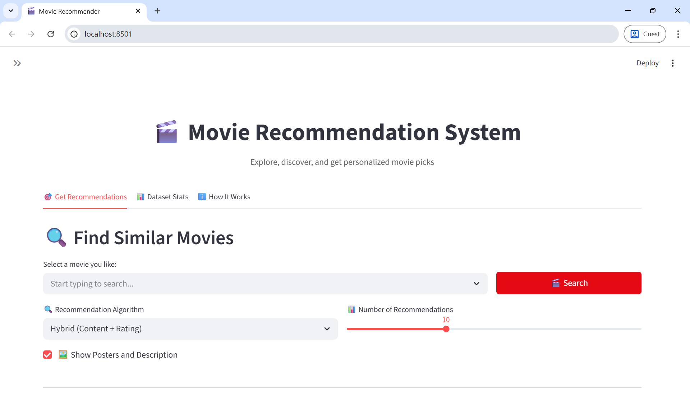
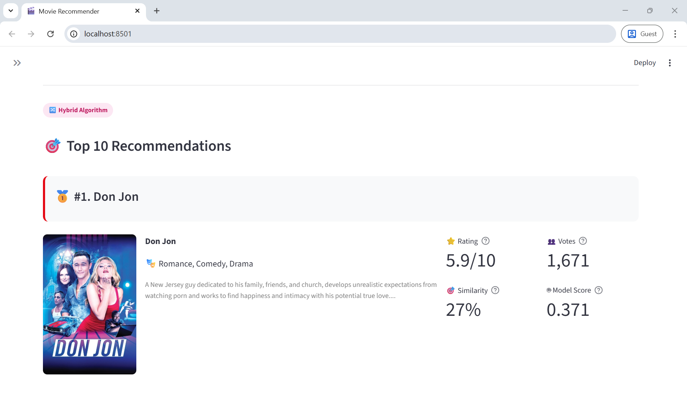
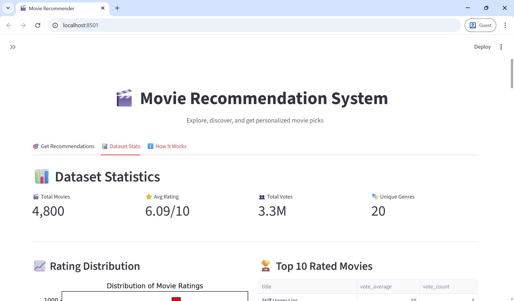
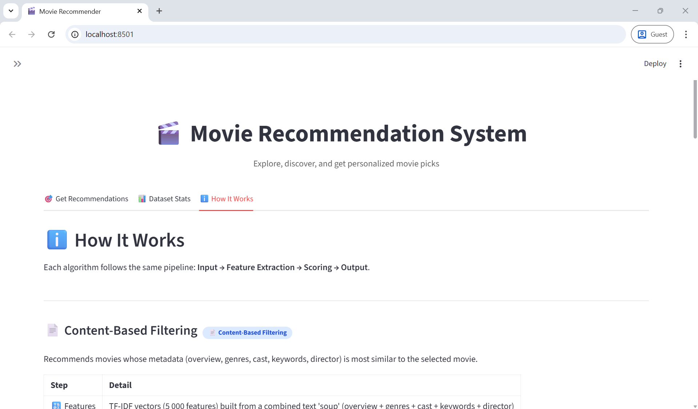
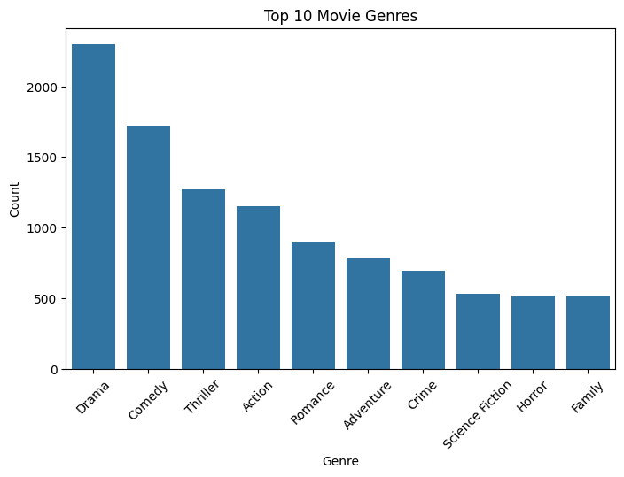
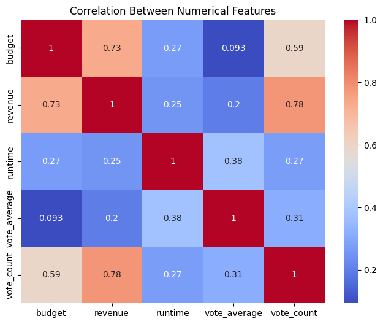
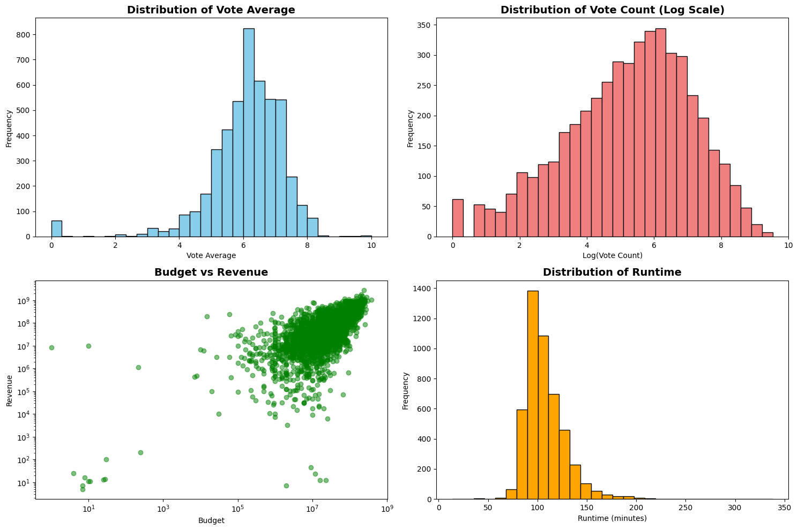
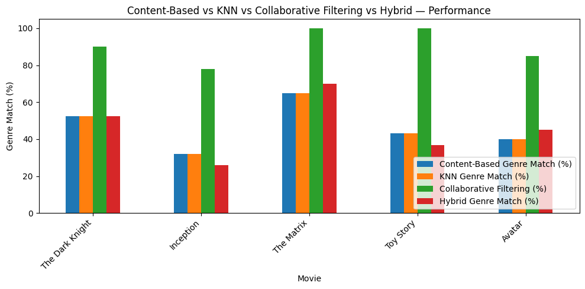

# 🎬 Movie Recommendation System


---

## ✨ Overview

This is a **Data Science portfolio project** that builds a full-featured movie recommendation web application using the [TMDB 5000 Movie Dataset](https://www.kaggle.com/datasets/tmdb/tmdb-movie-metadata) from Kaggle.

The app implements and compares **four distinct recommendation strategies** side-by-side:

```
🎯 Content-Based Filtering    →   TF-IDF + Cosine Similarity
🔵 KNN-Based Filtering         →   K-Nearest Neighbours in TF-IDF space
🤝 Collaborative Filtering     →   Simulated SVD Matrix Factorization
🔀 Hybrid Approach             →   Content Similarity + IMDB Weighted Rating
```

Everything is served through a beautiful, Netflix-inspired **Streamlit** interface with live poster fetching, CSV export, and interactive dataset exploration.

---

## 🌟 Features

```
🔍  Search across 4,800+ movies with smart autocomplete
🤖  4 recommendation algorithms switchable at runtime
🖼️  Live movie posters & overviews from the TMDB API
⭐  Rating, vote count, similarity %, and model score per result
📥  Download any recommendation list as a CSV file
📊  Dataset Statistics tab — distributions, genres, top charts
ℹ️  How It Works tab — pipeline diagrams, formulas, and notes
🎨  Netflix-inspired UI with custom CSS theming
🏅  Gold / Silver / Bronze rank medals for top recommendations
```

---

## 🖥️ Demo

| 🔍 Search & Discover | 🎯 Recommendation Results |
|:---:|:---:|
|  |  |

| 📊 Dataset Statistics | ℹ️ How It Works |
|:---:|:---:|
|  |  |

---

## 🗂️ Dataset

**📦 Source:** [TMDB 5000 Movie Dataset — Kaggle](https://www.kaggle.com/datasets/tmdb/tmdb-movie-metadata)

| 🎬 Total Movies | ⭐ Avg Rating | 👥 Total Votes | 🎭 Unique Genres |
|:---:|:---:|:---:|:---:|
| **4,800** | **6.09 / 10** | **3.3 M** | **20** |

The dataset ships as two CSV files:

| 📄 File | 📋 Contents |
|---|---|
| `tmdb_5000_movies.csv` | Budget 💰, revenue 📈, genres 🎭, keywords 🔑, overview 📝, popularity 🔥, release date 📅, runtime ⏱️, ratings ⭐ |
| `tmdb_5000_credits.csv` | Cast 🎭 (top 3 actors) and crew 🎬 (director) |

> 📂 Place both files in the `data/` folder before running the app.

---

## 🤖 Algorithms

> 🔄 Every algorithm follows the same pipeline:
> **📥 Input → 🔣 Feature Extraction → 📐 Scoring → 📤 Output**

---

### 📄 Content-Based Filtering

> *"Find movies that look, feel, and sound like the one you already love."*

Recommends movies whose metadata — overview, genres, cast, keywords, and director — is most similar to the selected title using **TF-IDF** and **Cosine Similarity**.

| 🔣 Step | 📋 Detail |
|---|---|
| **Features** | TF-IDF vectors (5,000 features) from a combined text "soup": overview + genres + cast + keywords + director |
| **Scoring** | Cosine similarity against a precomputed N×N matrix |
| **Output** | Top-N movies ranked by highest cosine similarity |
| **Formula** | `similarity(A, B) = (A · B) / (‖A‖ × ‖B‖)` |
| **💡 Note** | Full similarity matrix precomputed once at startup — sub-millisecond lookup |

---

### 🔵 KNN-Based Filtering

> *"Find the nearest neighbours in high-dimensional movie space."*

Finds the **K-nearest neighbours** of the selected movie in TF-IDF space using a brute-force cosine distance search.

| 🔣 Step | 📋 Detail |
|---|---|
| **Features** | TF-IDF vectors (3,000 features) — reduced vocabulary for speed |
| **Scoring** | Cosine distance via `sklearn.NearestNeighbors` (brute-force, parallelised) |
| **Output** | Top-N closest neighbours sorted by descending similarity |
| **Formula** | `similarity = 1 − cosine_distance(A, B)` |
| **💡 Note** | More memory-efficient than a full N×N matrix; model is cached after the first build |

---

### 🤝 Collaborative Filtering (Simulated SVD)

> *"Discover what users with similar taste have loved."*

Simulates user–movie ratings and decomposes the matrix with **Singular Value Decomposition (SVD)** to surface hidden preference patterns.

| 🔣 Step | 📋 Detail |
|---|---|
| **Features** | Simulated 100-user × N-movie rating matrix built from genre preferences and vote averages |
| **Scoring** | Reconstructed ratings from SVD (k=15 latent factors) |
| **Output** | Top-N movies with the highest predicted average rating, normalised to [0, 1] |
| **Formula** | `A ≈ U · Σ · Vᵀ  (k = 15 latent factors)` |
| **💡 Note** | In production, the rating matrix would use real watch/rating history instead of simulated data |

---

### 🔀 Hybrid Approach ⭐ *Recommended*

> *"The best of both worlds — relevance meets quality."*

Combines content similarity with an **IMDB-style weighted rating** to balance what's *relevant* with what's genuinely *good*.

| 🔣 Step | 📋 Detail |
|---|---|
| **Features** | Content-Based cosine similarity + IMDB weighted rating (vote_average, vote_count) |
| **Scoring** | Linear combination: **70% content similarity + 30% normalised weighted rating** |
| **Output** | Top-N movies sorted by descending hybrid score |
| **Formula** | `hybrid = 0.7 × similarity + 0.3 × (WR / 10)` |
| **💡 Note** | `WR = (v/(v+m))×R + (m/(v+m))×C` · m = 70th-pct vote count · C = global mean |

---

## 🛠️ Tech Stack

| 🏷️ Layer | 📦 Library | 🎯 Purpose |
|---|---|---|
| 🖥️ **Web App** | Streamlit | Interactive UI & deployment |
| 🐼 **Data** | Pandas, NumPy | Data manipulation & vectorised operations |
| 🤖 **ML / NLP** | Scikit-learn | TF-IDF vectorizer, NearestNeighbors, cosine similarity |
| 🔢 **Matrix Math** | SciPy | Sparse matrices & SVD decomposition |
| 📊 **Visualisation** | Matplotlib | Charts and statistical plots |
| 🎬 **Posters & Meta** | TMDB REST API + Requests + Pillow | Live poster & description fetching |
| 📓 **Notebooks** | Jupyter | EDA & model evaluation |

---

## 📁 Project Structure

```
🎬 movie-recommender/
│
├── app.py                              ← Main Streamlit application
├── movie_recommendation_system.ipynb   ← EDA + model evaluation notebook
├── README.md                           ← You are here!
│
├── data/
│   ├── tmdb_5000_movies.csv               ← Movie metadata
│   └── tmdb_5000_credits.csv              ← Cast & crew data

└── images/
    ├── top_movie_genres.png
    ├── correlation_matrix.png
    ├── key_distributions_and_relationships.png
    └── all_models_performances.png
```

---

## ⚡ Installation

### 1️⃣ Clone the Repository

```bash
git clone https://github.com/adin-alxndr/movie-recommendation-system.git
cd movie-recommendation-system
```

### 2️⃣ Create a Virtual Environment *(recommended)*

```bash
# 🐍 Create environment
python -m venv venv

# ✅ Activate — macOS / Linux
source venv/bin/activate

# ✅ Activate — Windows
venv\Scripts\activate
```

### 3️⃣ Install Dependencies
```
streamlit>=1.30
pandas>=2.0
numpy>=1.24
scikit-learn>=1.3
scipy>=1.11
matplotlib>=3.7
requests>=2.31
Pillow>=10.0
```

### 4️⃣ Download the Dataset

Download both CSVs from [Kaggle](https://www.kaggle.com/datasets/tmdb/tmdb-movie-metadata) and place them in the `data/` folder:

```
📂 data/
   ├── tmdb_5000_movies.csv
   └── tmdb_5000_credits.csv
```

### 5️⃣ Launch the App 🚀

```bash
streamlit run app.py
```

Open your browser at **`http://localhost:8501`** 🎉

---

## 🔑 Configuration

### 🎬 TMDB API Key *(optional but strongly recommended)*

Movie posters and descriptions are fetched live from the **TMDB API**. Without a key the app still works — posters and overviews will simply be unavailable.

**Steps to set up:**

1. 🆓 Create a free account at [themoviedb.org](https://www.themoviedb.org/)
2. ⚙️ Go to **Settings → API** and generate a v3 API key
3. 📄 Create `.streamlit/secrets.toml`:

```toml
API_KEY = "your_tmdb_api_key_here"
```
---

## ▶️ Usage

### 🎯 Tab 1 — Get Recommendations

| Step | Action |
|:---:|---|
| 1️⃣ | Type or search for a movie in the smart dropdown |
| 2️⃣ | Choose a recommendation algorithm from the selector |
| 3️⃣ | Set the number of results with the slider (1–20) |
| 4️⃣ | Toggle movie posters & descriptions on / off |
| 5️⃣ | Click **🔍 Search** |
| 6️⃣ | Optionally export results as a **📥 CSV** file |

### 📊 Tab 2 — Dataset Stats

Explore the full dataset with interactive charts:
-  Rating distribution histogram
-  Top 10 rated movies table
-  Genre breakdown bar chart & percentage table
-  Most popular movies list
-  Vote count distribution (log scale)
-  Browsable full movie catalogue

### ℹ️ Tab 3 — How It Works

Deep-dive into each algorithm with:
-  Pipeline explanations (Input → Features → Scoring → Output)
-  Mathematical formulas
-  Feature engineering details
-  Production notes and caveats
-  Metrics legend (Rating, Votes, Similarity %, Model Score)

---

## 🔬 EDA Highlights

> 📓 Full analysis in `movie_recommendation_system.ipynb`

### 🎭 Top 10 Genre Distribution



Drama leads the dataset with **~2,300 titles**, followed by Comedy (**~1,700**) and Thriller (**~1,300**). Niche genres like Science Fiction 🚀, Horror 👻, and Family 👨‍👩‍👧 each contribute around **~500** titles.

---

### 🔗 Numerical Feature Correlations



| 🔗 Feature Pair | Correlation | 💡 Key Insight |
|---|:---:|---|
| 💰 Budget ↔ 📈 Revenue | **r = 0.73** 🔴 | Big budgets tend to earn big returns |
| 📈 Revenue ↔ 👥 Votes | **r = 0.78** 🔴 | Popular movies attract more voters |
| ⏱️ Runtime ↔ ⭐ Rating | **r = 0.38** 🟡 | Longer films tend to rate slightly higher |
| 💰 Budget ↔ ⭐ Rating | **r = 0.09** 🔵 | Spending more ≠ better reviews |

---

### 📊 Key Distributions & Relationships



| 📈 Chart | 💡 Insight |
|---|---|
| ⭐ Vote Average | Ratings cluster between **5–7.5** / 10; slight left skew from poorly-rated outliers |
| 👥 Vote Count (log) | Bell-shaped on log scale — most movies have between e⁴–e⁷ votes |
| 💰 Budget vs Revenue | Strong positive correlation; a few blockbusters dominate the upper-right quadrant |
| ⏱️ Runtime | Sweet spot is **90–120 min**; sharp drop-off beyond 150 min |

---

## 📈 Model Performance

Evaluated on **5 benchmark movies** — The Dark Knight, Inception, The Matrix, Toy Story, and Avatar — using **Genre Match %** as a proxy for recommendation relevance.

### 📊 All Models Performance Chart



### 🏆 Average Genre Match Score

| 🥇 Rank | 🤖 Model | 🎯 Avg Genre Match | 📊 Score Bar |
|:---:|---|:---:|---|
| 🥇 1st | 🤝 Collaborative Filtering | **90.60%** | `████████████████████` |
| 🥈 2nd | 📄 Content-Based Filtering | **46.57%** | `██████████░░░░░░░░░░` |
| 🥈 2nd | 🔵 KNN-Based Filtering | **46.57%** | `██████████░░░░░░░░░░` |
| 🥉 4th | 🔀 Hybrid Approach | **46.03%** | `█████████░░░░░░░░░░░` |

### 📊 Per-Movie Breakdown

| 🎬 Movie | 📄 Content-Based | 🔵 KNN | 🤝 Collaborative | 🔀 Hybrid |
|---|:---:|:---:|:---:|:---:|
| The Dark Knight | 52% | 52% | 🟢 90% | 52% |
| Inception | 32% | 32% | 🟢 78% | 26% |
| The Matrix | 65% | 65% | 🟢 100% | 70% |
| Toy Story | 43% | 43% | 🟢 100% | 37% |
| Avatar | 40% | 40% | 🟢 85% | 45% |

### 🎬 Sample Recommendation Comparison

<details>
<summary>🦇 <b>The Dark Knight</b> — click to expand</summary>

| # | 📄 Content-Based | 🔵 KNN | 🤝 Collaborative | 🔀 Hybrid |
|---|---|---|---|---|
| 1 | The Dark Knight Rises | The Dark Knight Rises | Scarface | The Dark Knight Rises |
| 2 | Batman Begins | Batman Begins | The Dark Knight Rises | Batman Begins |
| 3 | Batman Returns | Batman Returns | Bound by Honor | Batman Returns |
| 4 | Batman Forever | Batman Forever | The Silence of the Lambs | Batman Forever |
| 5 | Batman: The Dark Knight Return | Batman: The Dark Knight Return | The Usual Suspects | Batman |

</details>

<details>
<summary>🌀 <b>Inception</b> — click to expand</summary>

| # | 📄 Content-Based | 🔵 KNN | 🤝 Collaborative | 🔀 Hybrid |
|---|---|---|---|---|
| 1 | Don Jon | Don Jon | Serenity | Don Jon |
| 2 | Premium Rush | Premium Rush | Mad Max: Fury Road | Premium Rush |
| 3 | Hesher | Hesher | Mad Max 2: The Road Warrior | Mission: Impossible - Rogue Nation |
| 4 | Central Intelligence | Central Intelligence | The Fifth Element | (500) Days of Summer |
| 5 | Cypher | Cypher | Predator | The Wolf of Wall Street |

</details>

<details>
<summary>🧸 <b>Toy Story</b> — click to expand</summary>

| # | 📄 Content-Based | 🔵 KNN | 🤝 Collaborative | 🔀 Hybrid |
|---|---|---|---|---|
| 1 | Toy Story 3 | Toy Story 3 | Inside Out | Toy Story 3 |
| 2 | Toy Story 2 | Toy Story 2 | Up | Toy Story 2 |
| 3 | The 40 Year Old Virgin | The 40 Year Old Virgin | Toy Story 3 | The 40 Year Old Virgin |
| 4 | Class of 1984 | Class of 1984 | Monsters, Inc. | The Shawshank Redemption |
| 5 | Factory Girl | Factory Girl | Big Hero 6 | The Lego Movie |

</details>

### 💡 Key Takeaways

- **Collaborative Filtering** dominates on genre match (**90.60%**) — it finds thematically consistent recommendations by leveraging simulated user preference patterns.
- **Content-Based & KNN** are tied (**46.57%**) and produce near-identical results since both rely on TF-IDF text similarity. They excel at franchise/sequel continuity (e.g. Batman films).
- **Hybrid** scores slightly lower (**46.03%**) on genre match alone, but delivers better *quality-adjusted* results by promoting well-rated films alongside similar ones.
- Genre match is a **proxy metric** — in practice, user satisfaction depends on factors beyond genre (e.g. director style, tone, era). The Hybrid model is still recommended for production.

---

## 🗺️ Roadmap

- [ ] Integrate real user ratings (MovieLens dataset) for collaborative filtering
- [ ] Add genre, release year, and language filters to the recommendation UI
- [ ] Deploy to Streamlit Community Cloud with automated CI/CD pipeline
- [ ] Add BERT-based semantic similarity as an alternative to TF-IDF
- [ ] Implement A/B testing to compare algorithms with real user feedback
- [ ] Improve mobile-responsive layout
- [ ] PostgreSQL backend to persist user favourites and history

---

## 🤝 Contributing

Contributions are **very welcome**! 🙌 Here's how to get involved:

```bash
# 1️⃣ Fork the repo on GitHub

# 2️⃣ Clone your fork
git clone https://github.com/adin-alxndr/movie-recommendation-system.git

# 3️⃣ Create a feature branch
git checkout -b feature/your-awesome-feature

# 4️⃣ Make your changes and commit
git commit -m "✨ Add your awesome feature"

# 5️⃣ Push and open a Pull Request
git push origin feature/your-awesome-feature
```

> 💬 Please open an **Issue** first to discuss major changes. All PRs welcome!

---

## 📄 License

This project is open-source and available under the [MIT License](LICENSE).

---

## 🙋 Author

Made by [adin-alxndr](https://github.com/adin-alxndr/)
